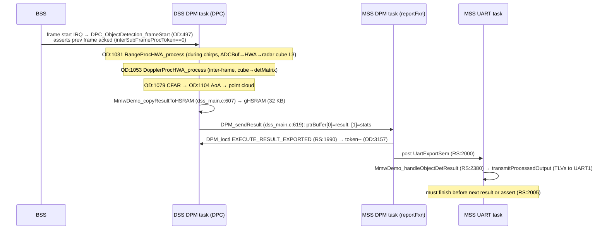

# 03 - Existing Runtime (initial)

## Core roles

MSS (runs freertos) has a mailbox mmWaveLink to BSS (RF stuff) and DPM over IPC notify for DSS.

BSS has the mailbox to MSS and uses buffer (ADCBuf) to carry data to DSS

DSS has the interactions described above ^^^

## Boot sequence

**MSS** (`mss_main.c`, RadarSetup.c):

1. `main()` (`mss_main.c:181`) runs `System_init`, `Board_init`, creates `mmwdemo_init_task`, then starts the scheduler.
2. `MmwDemo_initTask` (`mss_main.c:134`) runs these in order:
   1. `setupInit()` (RS:3395):
      - `Drivers_open` and `Board_driversOpen`
      - ECC setup
      - LVDS/CBUFF init plus a 12 ms wait
      - ADC-dither HWI
      - UART handles: CLI on UART0, data on UART1
      - creates the semaphores `DPMstart`, `DPMstop`, `DPMioctl`, `UartExport` and `demoInitTaskComplete`
      - `MMWave_init` (RS:3508), then `MMWave_sync` (RS:3523)
   2. `initCtrlTask()` (RS:3534)
   3. ~~`initEnetTask()`~~, commented out
   4. `initDPMTask()` (RS:3569):
      - `DPM_init(REMOTE, reportFxn)`
      - polls `DPM_synch` every 1 ms
      - creates the DPM task
      - runs `MmwDemo_calibInit`
   5. `initUartTask()` (RS:3635)
   6. `MmwDemo_CLIInit(7)` (`mss_main.c:151`) opens the CLI, which creates `cli_task_main`
   7. Blocks forever on `demoInitTaskCompleteSem`.

**DSS** (`dss/dss_main.c`):

1. `main()` runs `System_init` and `Board_init`, then creates `MmwDemo_dssInitTask` (priority 1).
2. The init task:
   1. `MmwDemo_dataPathOpen` (drivers, EDMA, `HWA_open`)
   2. ECC setup
   3. Fills the DPC init params (L3 = `gMmwL3`, L2 heap, EDMA, callbacks)
   4. `DPM_init(REMOTE, &gDPC_ObjectDetectionCfg)`
   5. Polls `DPM_synch`
   6. Creates the DPM task (priority 5), then blocks.

## Sensor bring-up (CLI task, on `sensorStart`)

```
sensorStart (mmw_cli.c:158)
 ├─ first time: MmwDemo_openSensor (RS:2668) → MMWave_open (76–81 GHz, calib restore) → ADCBuf_open
 ├─ MmwDemo_configSensor (RS:2990) → MMWave_config (profiles/chirps/frame → BSS)
 │                                 → MmwDemo_dataPathConfig (RS:1355): RF parser → DPM_ioctl(PRE_START_COMMON, PRE_START per subframe, dynamic cfgs)
 └─ MmwDemo_startSensor (RS:3033) → LVDS HW session → DPM_start (wait DPMstartSem) → MMWave_start
sensorStop → MmwDemo_stopSensor (RS:3103): MMWave_stop → wait FRAME_END→DPM_stop → delete CBUFF sessions
```

## FreeRTOS Tasks

| Core | Task                           | Function                                                 | Prio  | Stack (words) | Blocks on                                  |
| ---- | ------------------------------ | -------------------------------------------------------- | ----- | ------------- | ------------------------------------------ |
| MSS  | `mmwdemo_init_task`            | `MmwDemo_initTask`                                       | 1     | 4096          | semaphore (forever)                        |
| MSS  | `mmwdemo_ctrl_task`            | `MmwDemo_mmWaveCtrlTask` (RS:1060)                       | 10    | 3072          | `MMWave_execute` (BSS mailbox)             |
| MSS  | `mmwdemo_dpm_task`             | `mmwDemo_mssDPMTask` (RS:2591)                           | 9     | 6144          | `DPM_execute` (DSS IPC). Runs `reportFxn`. |
| MSS  | `mmwdemo_uart_task`            | `mmwDemo_mssUartDataExportTask` (RS:2615)                | 8     | 4096          | `UartExportSem`                            |
| MSS  | `cli_task_main`                | `CLI_task` (SDK lib)                                     | 7     | 4096          | UART0 polling                              |
| MSS  | lwIP tcpip                     | lwIP                                                     | 7     | -             | (only when ENET is enabled)                |
| MSS  | `enet_task` / `tcpinit_thread` | `enetTask`, `AppTcp_simpleclient`                        | 2 / 1 | 4096 / 8 KB   | disabled                                   |
| DSS  | init                           | `MmwDemo_dssInitTask`                                    | 1     | 1K            | semaphore                                  |
| DSS  | DPM task                       | `MmwDemo_DPC_ObjectDetection_dpmTask` (`dss_main.c:577`) | 5     | -             | `DPM_execute`                              |

Priorities on the MSS are set by RS:67–71 (ENET build). All tasks are created with `xTaskCreateStatic` inside an `init*Task()` wrapper. That pattern is what the README calls the "constructor approach".

## Per-frame data flow



**Deadlines:**

- The DSS must finish the chain, and the MSS must acknowledge, before the **next frame start**. Otherwise `OD:511` asserts.
- The MSS UART export must finish before the next result arrives.

## Synchronisation objects (MSS)

| Object                               | Posted by                           | Waited by                         |
| ------------------------------------ | ----------------------------------- | --------------------------------- |
| `DPMioctlSem`                        | reportFxn on IOCTL report (RS:1955) | `MmwDemo_DPM_ioctl_blocking`      |
| `DPMstartSem` / `DPMstopSem`         | reportFxn (RS:1971 / 2031)          | start/stop sensor                 |
| `UartExportSem`                      | reportFxn (RS:2000)                 | UART task                         |
| `lvdsStream.hwFrameDoneSem`          | CBUFF frame-done callback           | `handleObjectDetResult` (RS:2459) |
| `EnetCfgDoneSem`, `objDataSemaphore` | `enetStreamCfg` CLI, RS:871         | TCP client (disabled)             |

## CLI

- **mmWave extension commands** live in `SDK/ti/utils/cli/src/cli_mmwave.c`:

  - `flushCfg`, `dfeDataOutputMode`, `channelCfg`, `adcCfg`
  - `profileCfg`, `chirpCfg`, `frameCfg`, `advFrameCfg`, `subFrameCfg`
  - `advChirpCfg`, `LUTDataCfg`, `lowPower`, …

  `profileCfg` and `chirpCfg` call `MMWave_addProfile/addChirp` immediately.

- **Demo commands** live in `mmw_cli.c:2177–2356`:

  - `sensorStart/Stop`, `guiMonitor`, `cfarCfg`, `cfarFovCfg`, `aoaFovCfg`
  - `multiObjBeamForming`, `calibDcRangeSig`, `clutterRemoval`
  - `compRangeBiasAndRxChanPhase`, `measureRangeBiasAndRxChanPhase`, `extendedMaxVelocity`
  - `adcbufCfg`, `CQRxSatMonitor`, `CQSigImgMonitor`, `analogMonitor`
  - `lvdsStreamCfg`, `configDataPort`, `queryDemoStatus`, `calibData`, `procChain`
  - `enetStreamCfg`, `queryLocalIp`
  - `spreadSpectrumConfig`, `adcDataDitherCfg`

- **Parse path for demo commands:** `atoi`/`atof` → temporary struct → `MmwDemo_CfgUpdate` (RS:569). That copies into `gMmwMssMCB.subFrameCfg[i]` at a fixed offset (`mmw_mss.h` offsets) and sets a "pending" bit. **Unknown offsets assert**, so custom config must not go through it.

- **Derived parameters:** `MmwDemo_RFParser_parseConfig` (`mmwdemo_rfparser.c:1980`) computes `numRangeBins`, `numDopplerChirps/Bins`, `rangeStep`, `dopplerStep` and the virtual antennas. `MmwDemo_dataPathConfig` packs them into `DPC_ObjectDetection_PreStartCfg`.

## UART output format (`include/mmw_output.h`)

TLV = type-length-value

Which is the format of uart packet

- **Header**, 40 B:
  - magic `0x0102 0x0304 0x0506 0x0708`
  - version, totalPacketLen (padded to 32 B), platform `0x2944`
  - frameNumber, timeCpuCycles, numDetectedObj, numTLVs, subFrameNumber
- **TLVs:** each is `{type, length}` (8 B) followed by the payload. Types:
  1. points
  2. range profile (detMatrix at Doppler bin 0)
  3. noise profile
  4. azimuth heatmap
  5. range-Doppler heatmap
  6. stats
  7. side info
  8. (unused)
  9. temperature
- Which TLVs are sent is selected per subframe by `guiMonitor`.
- Data UART runs at 3.125 Mbaud.

## LVDS / ENET

- **LVDS:** a CBUFF **hardware session** streams raw ADC data per chirp with no CPU involvement, as format 1 (ADC) or 4 (CP+ADC+CQ). The **software session** (user data) is implemented but never called.
- **ENET:** `enet_stream.c` runs CPSW RGMII with a static IP of 192.168.1.200. `enet_tcpclient.c` is a TCP client on port 7 that sends the point cloud only, through a single buffer with a `ready` flag. It is disabled, and has defects D1–D3 ([02](02_existing_codebase.md)).
