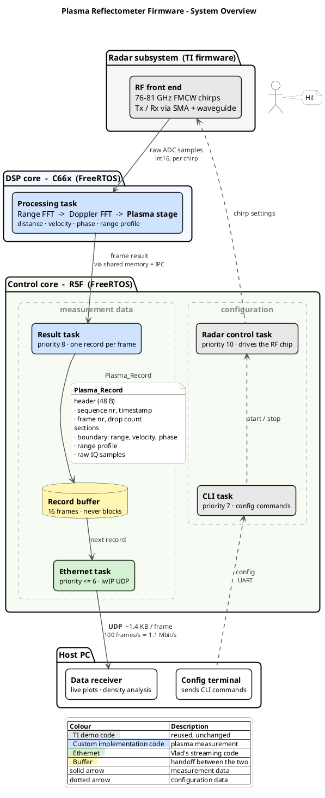
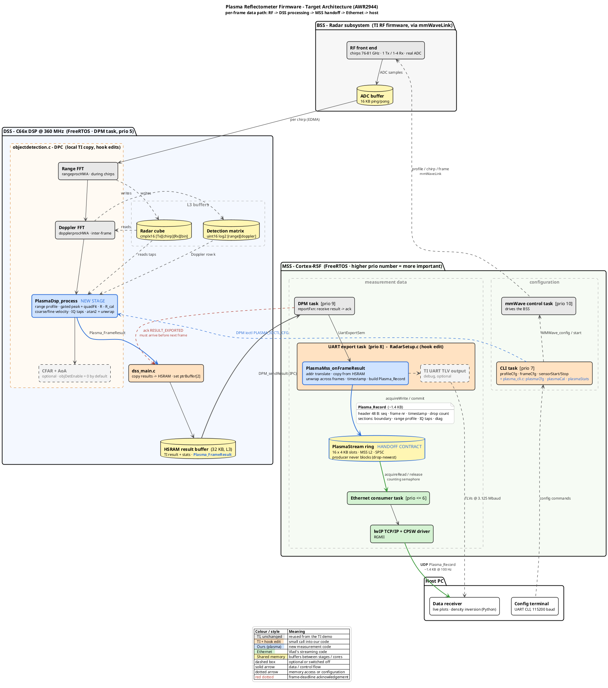

# 06 - Target Architecture (planned)

This is where the show starts

## Principles and rules

1. **Keep TI's frame machinery.** 
   This covers mmWave control, DPM, the rangeproc/dopplerproc DPUs, and the HSRAM result path. We only insert stages and do not rewrite them.
2. **Heavy maths on the DSS, light maths on the MSS.**
   Per-chirp work stays in DSS. The MSS does cross-frame tracking, timestamping and packaging.
3. **Our code lives in our own files.**
   Edits to TI files are limited to single-line hook calls. Nothing in `Dependencies/` is edited.
4. **One-way, non-blocking handoff to Ethernet.** 
   The measurement path must never wait on the network. Frames are dropped with a counter rather than stalling the chain, because stalling makes the DPC assert (OD:511).
5. **The DSS -> MSS -> Ethernet path is one frame record per (sub)frame.**
   UART TLV output is kept as a debug path and is optional.

## Component view diags

## New expected files

| File                                           | Core |
| ---------------------------------------------- | ---- |
| `Radar_common/plasma/plasma_types.h`           | both |
| `Radar_Program_dss/plasma/plasma_dsp.{h,c}`    | DSS  |
| `Radar_Program_mss/plasma/plasma_mss.{h,c}`    | MSS  |
| `Radar_Program_mss/plasma/plasma_cli.{h,c}`    | MSS  |
| `Radar_Program_mss/plasma/plasma_stream.{h,c}` | MSS  |

## Edits to TI files

| File                                                            | Edit                                                                                                                                                                                                                                                                                                                                                                                  | Why              |
| --------------------------------------------------------------- | ------------------------------------------------------------------------------------------------------------------------------------------------------------------------------------------------------------------------------------------------------------------------------------------------------------------------------------------------------------------------------------- | ---------------- |
| `Radar_Program_dss/objectdetection.c`                           | (1) After `DPU_DopplerProcHWA_process` (OD:1053) call `PlasmaDsp_process(radarCube, detMatrix, &plasmaResult)`.  (2) Skip CFAR/AoA (OD:1079–1118) when `cfg.objDetEnable == 0`, setting `numObjOut = 0`.  (3) Add `case PLASMA_IOCTL_CFG:` to the ioctl switch (near OD:3176).   (4) In `DPC_ObjDet_preStartConfig` (≈OD:2789), allocate plasma scratch from the L2 heap. | Insert the stage |
| `Radar_Program_dss/dss/dss_main.c`                              | After `MmwDemo_copyResultToHSRAM` (`dss_main.c:607`), copy `Plasma_FrameResult` into the remaining HSRAM payload. The function returns the remaining bytes, so the offset is `MMWDEMO_HSRAM_PAYLOAD_SIZE − ret`. Set `resultBuffer.ptrBuffer[2]`/`size[2]`. `DPM_MAX_BUFFER = 3`, and slot 2 is free.                                                                                 | Transport to MSS |
| `Radar_Program_mss/utils/RadarSetup.c`                          | (1) In `MmwDemo_handleObjectDetResult` (RS:2380), call `PlasmaMss_onFrameResult(&gMmwMssMCB.ptrResult)` before `MmwDemo_transmitProcessedOutput`. (2) At the end of `MmwDemo_dataPathConfig` (RS:1355), call `PlasmaMss_sendCfgToDss()`. (3) Remove the stock ENET producer block (RS:853–873), which fixes D3.                                                                       | Hooks            |
| `Radar_Program_mss/mss/mmw_cli.c`                               | In `MmwDemo_CLIInit`, call `PlasmaCli_register(&cliCfg, &cnt)` before `CLI_open`. Watch `CLI_MAX_CMD = 40`.                                                                                                                                                                                                                                                                           | CLI              |
| `Radar_Program_mss/mss/mss_main.c`                              | Call `PlasmaMss_init()` right after `initCtrlTask()` (`mss_main.c:137`). Then the colleague's `Net_init()` goes in place of `initEnetTask` (line 139). The order is in [08](08_init_and_config.md).                                                                                                                                                                                   | Init             |
| `Radar_Program_dss/c66x_linker.cmd` (+ MSS `r5f_linker_BU.cmd`) | Split L3 so the cores do not overlap (fixes D1, see [09](09_memory_budget.md))                                                                                                                                                                                                                                                                                                        | Memory           |

## DSS stage: `PlasmaDsp_process`

**Inputs:**

- `DPIF_RadarCube` (FMT1, L3)
- `DPIF_DetMatrix` (L3)
- `Plasma_Cfg`
- derived parameters from `staticCfg`: `numRangeBins`, `numDopplerChirps`, `numRxAntennas`, `rangeStep`, `dopplerStep`

**Steps** (all from [05](05_measurement_algorithms.md)):

1. Coherent range profile over the gate. Output is `float` power, decimated to `uint16` dB×100 for transport.
2. Peak, SNR and quadFit, minus `R_cal`, giving `rangeM`.
3. Doppler peak in detMatrix row k, giving `velCoarse`.
4. Cube taps: `nPhaseBins` × `numDopplerChirps` complex samples, Rx-combined. Then `atan2sp_v`, intra-frame unwrap, and pulse-pair `velFine`.
5. Fill `Plasma_FrameResult` (layout in [07](07_data_handoff_contract.md) §Payload), with `subFrameIdx` and `fCenterHz` taken from the profile.

## MSS stage: `PlasmaMss_onFrameResult`

Runs in the **UART export task** (priority 8) after the DPM report.

1. `AddrTranslateP_getLocalAddr(ptrBuffer[2])` gives the pointer to `Plasma_FrameResult`.
2. `PlasmaStream_acquireWrite()` returns a slot, or NULL if the ring is full. On NULL, count a drop and skip.
3. Fill the record header: magic, version, seq, `timestampUs` from the R5F cycle counter, `frameNumber` from the result stats, `subFrameIdx`, flags.
4. `memcpy` the payload from HSRAM into the slot. That is ≤ 8 KB, roughly tens of µs.
5. Cross-frame processing: unwrap the frame phase against the previous value of the same subframe; accumulate displacement; apply an optional EMA on range.
6. `PlasmaStream_commit()`. This publishes the record and notifies the consumer.
