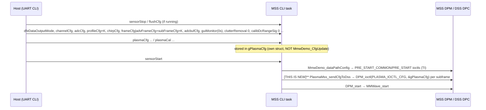

# 08 - Initialisation & Configuration

## Target init sequence

**MSS** — `MmwDemo_initTask` (`mss_main.c:134`). New steps are marked with **[THIS IS NEW]**.

```
setupInit → initCtrlTask → ★PlasmaMss_init → ★Net_init → initDPMTask → initUartTask → MmwDemo_CLIInit
```

1. `setupInit()`: drivers, UARTs, semaphores, `MMWave_init`/`MMWave_sync`. Unchanged.

2. `initCtrlTask()`: mmWave control task, priority 10.

3. **[THIS IS NEW]** `PlasmaMss_init()`:

   - calls `PlasmaStream_init()` (ring + counting semaphore)
   - sets the default `Plasma_Cfg`
   - resets cross-frame state

   It creates no task. It must come **before** `Net_init`, so the ring exists before the consumer pends on it.

4. **[THIS IS NEW]** `Net_init()` (vlad's: replaces `initEnetTask`, `mss_main.c:139`). Brings up CPSW/lwIP and creates the consumer task, which idles in `PlasmaStream_acquireRead`.

5. `initDPMTask()`: `DPM_init` + `DPM_synch` with the DSS, then the DPM task (priority 9).

6. `initUartTask()`: UART export task (priority 8). This hosts our producer hook.

7. `MmwDemo_CLIInit(7)` (with **[THIS IS NEW]** `PlasmaCli_register` inside). The CLI task starts here.

Nothing streams until `sensorStart`. Before that, the consumer just idles.

**DSS** — no new init step. `PlasmaDsp_init` is called from the DPC's `DPC_ObjectDetection_init` path, or lazily from the first `PLASMA_IOCTL_CFG`. Scratch memory is allocated in `DPC_ObjDet_preStartConfig` from the existing L2/L3 heaps, so it follows the DPC's per-config allocation lifecycle.

## Runtime configuration flow



### Custom DPM ioctl

- `#define PLASMA_IOCTL_CFG (DPM_CMD_DPC_START_INDEX + 100U)`, defined in `plasma_types.h`. TI uses +0…+15.
- The MSS sends it with `MmwDemo_DPM_ioctl_blocking`, and it is handled in the local `objectdetection.c` ioctl switch.
- Payload: `Plasma_Cfg` (+ `subFrameIdx`). Keep it ≤ the DPM ioctl argument limit **[TODO TODO TODO check size limit in dpm.h]**.
- Fallback if forwarding fails: carry `Plasma_Cfg` in an unused region of HSRAM written by the MSS before `DPM_start`.

## Added new CLI commands

Registered via `PlasmaCli_register`. Values are stored in `gPlasmaCfg` on the MSS. They are applied at the next `sensorStart`, or immediately for "dynamic" fields if the sensor is running. Dynamic changes are copied into the next config ioctl between frames, the same way TI handles pending dynamic config (RS:2116).

| Command       | Args                                                                                              | Static/dynamic                                              |
| ------------- | ------------------------------------------------------------------------------------------------- | ----------------------------------------------------------- |
| `plasmaCfg`   | `<subFrameIdx\|-1> <gateMinM> <gateMaxM> <snrThrDb> <nPhaseBins> <objDetEnable 0/1> <outputMask>` | gate, threshold: dynamic. nPhaseBins, objDetEnable: static. |
| `plasmaCal`   | `<rangeOffsetM> [<phaseOffsetRad>]`                                                               | dynamic                                                     |
| `plasmaStats` |                                                                                                   | Prints `PlasmaStream_getStats` and the DSS cycle counts     |

- `outputMask` bits: 0 `RANGE_PROFILE`, 1 `IQ_TAPS`, 2 `DIAG`, 3 `UART_TLV` (keep the TI UART output on).
- `CLI_MAX_CMD` is 40 (`SDK/ti/utils/cli/cli.h:117`). Count the table entries after adding these.

`Plasma_Cfg` (shared struct, fixed-width fields):

```c
typedef struct {
    int8_t   subFrameIdx;      /* -1 = all */
    uint8_t  nPhaseBins;       /* 1..8, odd */
    uint8_t  objDetEnable;     /* run TI CFAR/AoA */
    uint8_t  rsvd;
    uint32_t outputMask;
    float    gateMinM, gateMaxM;
    float    snrThrDb;
    float    rangeOffsetM;     /* R_cal */
    float    phaseOffsetRad;
} Plasma_Cfg;
```

## Start / stop / reconfigure

1. `sensorStop`: waits for `FRAME_END` → `DPM_stop`.
2. `flushCfg`: clears the mmWave profiles and chirps.
3. Re-send the **complete** config file, including the `plasma*` commands.
4. `sensorStart` (without `0`).

When changing `channelCfg` or `adcCfg`  after initial bootup start something in mmw_cli.c is supposed to assert. **[TODO TODO check which function]**.

## Reference config serial config

Built upon TI's bootup sequence. AWR2944 demo from:
`https://dev.ti.com/gallery/view/mmwave/mmWave_Demo_Visualizer/ver/4.7.0/`

**[TODO TODO maybe make our own .html with added plasma ctrl?]**.

```
sensorStop
flushCfg
dfeDataOutputMode 1
channelCfg 15 1 0                 % 4 Rx, Tx0 only   [CONFIRM which ports are connected]
adcCfg 2 1                        % 16-bit, real
adcbufCfg -1 1 1 1 1              % real, non-interleaved, chirpThreshold 1
profileCfg 0 76.5 7 5 50 0 0 80 1 512 12800 0 0 30
chirpCfg 0 0 0 0 0 0 0 1
frameCfg 0 0 64 0 10 1 0          % 64 loops, infinite, 10 ms
guiMonitor -1 0 0 0 0 0 0         % TI UART TLVs off
cfarCfg -1 0 2 8 4 3 0 15 1       % required by TI parser even if objDet disabled
cfarCfg -1 1 0 4 2 3 1 15 1
multiObjBeamForming -1 0 0.5
clutterRemoval -1 0
calibDcRangeSig -1 0 -5 8 256
extendedMaxVelocity -1 0
compRangeBiasAndRxChanPhase 0.0 1 0 1 0 1 0 1 0 1 0 1 0 1 0 1 0 1 0 1 0 1 0 1 0
measureRangeBiasAndRxChanPhase 0 1.5 0.2
aoaFovCfg -1 -90 90 -90 90
cfarFovCfg -1 0 0 12
cfarFovCfg -1 1 -17 17
lvdsStreamCfg -1 0 0 0            % LVDS off
plasmaCfg -1 0.3 8.0 12 3 0 7
plasmaCal 0.000
sensorStart
```

- Argument lists follow the SDK user guide §3.7 for TDM. **[TODO TODO TODO verify lines against the TDM CLI parser ]**
  parsing happens in files `Radar_Program_mss/mss/mmw_cli.c` , `Dependencies/mmwave_mcuplus_sdk_04_07_02_01/ti/utils/cli/src/cli_mmwave.c` , `Radar_Program_mss/utils/mmwdemo_rfparser.c`
- `compRangeBiasAndRxChanPhase` needs 1 + 2·(numTx·numRx) values; above is for 1×4 with identity weights.
